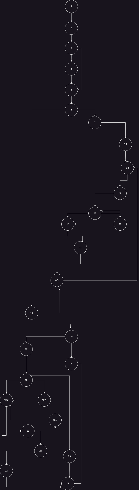

# Втора лабораториска вежба по Софтверско
# инженерство
# Ања Реџовска, бр. на индекс 213060
# Control Flow Graph

Цикломатска комплексност
Цикломатската комплексност во овој случај е 11. Ја добив преку броење на региони но, поради дополнителна проверка и со користење на формулата: E - N + 2P, каде E е бројот на edges, N е бројот на јазли, P е бројот на поврзани компоненти.

Тест случаи според критериумот Every branch
pateka 1.new User=(null, anja, anjared.gmail.com) 2.new User=(Anja, anja3456, anjared.gmail.com) 3.new User=(Anja, anja*+34, anjared@gmail.com) 4.new User=(Anja, a nja +34, anjaredz@gmail.com) pateka new User=(null, anja, anjared.gmail.com) new User=(Anja, anja3456, anjared.gmail.com) new User=(Anja, anja+34, anjared@gmail.com new User=(Anja, a nja *+34, anjaredz@gmail.com) 5.user null-веднаш паѓа
Потребни ми беа 5 test cases. Првиот за RuntimeException, вториот за да нема @ во email, третиот за во password да има специјални знаци, и четвртиот да има празно место во password, ако user e null кодот не продолжува.

Тест случаи според критериумот Multiple Condition
Потребни ми беа 4 тестови(за проверка Т || T || T = T, но секогаш кога на почеток на Т резултатот е Т-точен). if(user==null||user.getPassword()==null||user.getEmail()==null) F || T || T = T F || F || F = F F || T || F = T F || F || T = T
